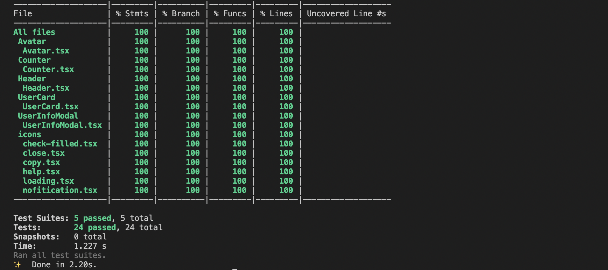
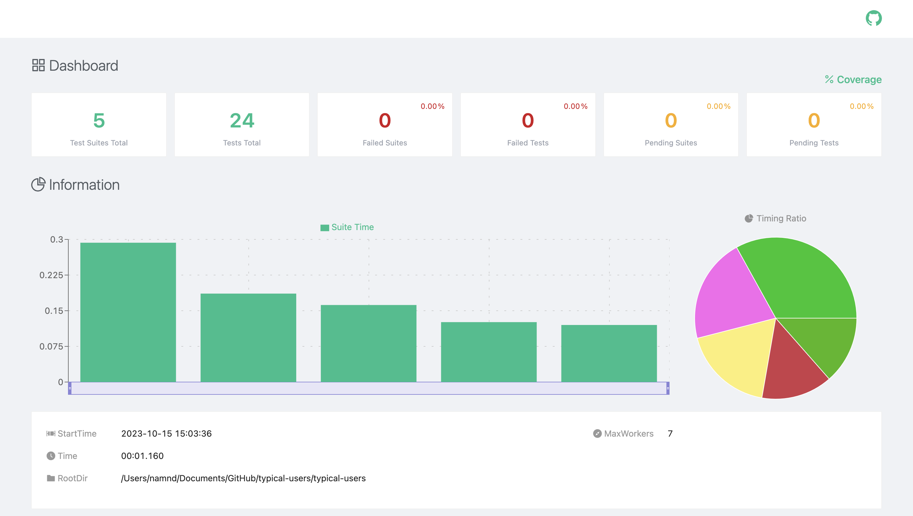

This is a [Next.js](https://nextjs.org/) project bootstrapped with [`create-next-app`](https://github.com/vercel/next.js/tree/canary/packages/create-next-app).

## Getting Started

```bash
git clone git@github.com:nguyend-nam/typicode-users.git my-project
cd my-project
yarn
```

Then, you can run locally in development mode with live reload:

```bash
yarn dev
```

Open [http://localhost:3000](http://localhost:3000) with your favorite browser to see your project.

```
.
├── README.md                    # README file
├── public/                      # Public folder
│   └── images                   # Images used by the app
├── lib/                         # Functions and schemas relating to API fetching
│   └── apis.ts
│   └── fetcher.ts
│   └── schema.ts
├── components/                  # Shared components
│   └── X/
│       └── index.ts
│       └── X.tsx
│       └── X.test.tsx
│── pages/                       # Next JS pages
│── styles/                      # Style folder
│── hooks/                       # Custom hooks folder
│── utils/                       # Utility folder
├── tailwind.config.js           # Tailwind CSS configuration
├── jest.config.js               # Jest configuration
├── jest.setup.js                # Jest setup
├── tsconfig.json                # TypeScript configuration
└── package.json
```

## Unit Test

```bash
yarn test
```

Please run this command, and you should see the coverage in the terminal.



**You can also use the web view** of the test report in the file `test-output/jest-html-reporters.html` after running the test command.




## Deployment

- Task 1: https://typicode-users.netlify.app/.
- Task 2: https://typicode-users.netlify.app/counter

## Tech stack

### Core

- [x] [React](https://reactjs.org/)
- [x] [Next.js](https://nextjs.org/)
- [x] [TypeScript](https://www.typescriptlang.org/)

### UI & styling

- [x] [TainwindCSS](https://tailwindcss.com/)
- [x] [HeadlessUI](https://headlessui.com/)

### Unit testing

- [x] [React Testing Library](https://testing-library.com/docs/react-testing-library/intro/)
- [x] [Jest](https://jestjs.io/)
- [x] [jest-html-reporters](https://github.com/Hazyzh/jest-html-reporters)
