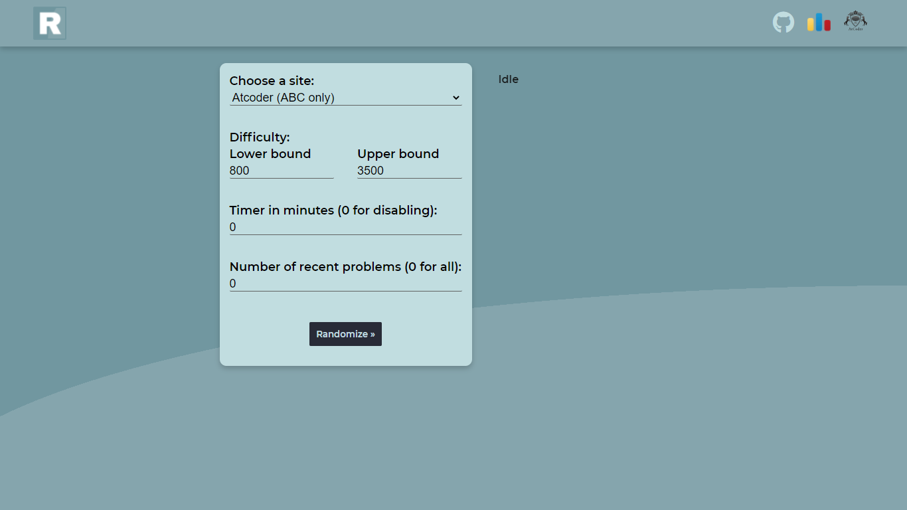

# 

<!-- # Problem Randomizer -->

<!--  -->
<!--  -->
<!--  -->

> A practice platform for competitive programmers using API key provided by [Codeforces](https://codeforces.com/) and [AtCoder](https://atcoder.jp/).

### **[→ Problem Randomizer](https://decsp.github.io/Problem-Randomizer/)**

<!-- ### How it works:
  - Choose site (Codeforces or AtCoder).
  - Specify the range of difficulty.
  - Click on "Randomize" to start selecting suitable coding problem.
  - *Optional*:
    - Set count-down timer for evaluating your practice.
    - Selecting number of recently added problems that you might get. -->
 

### Features:
  - [X] Randomly Select coding problem base on difficulty range (800 - 3500).
  - [X] Coding problems from Codeforces.
  - [X] Coding problems from AtCoder.
  - [X] Count-down timer provided.
  - [ ] Auto adjust mode and User specify mode.

### Authors:

` Work with API `

` Front-end stuff `
<!-- [  DecSP](https://github.com/DecSP) -->
